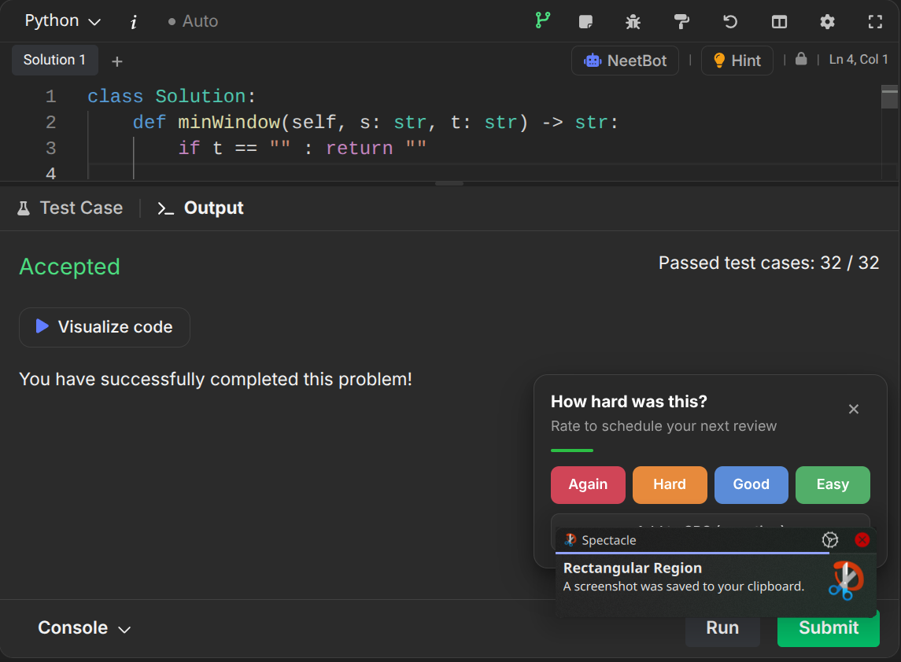

# NeetcodeSRS

<div align="center">

**Spaced repetition for NeetCode — rate problems where you solve them, review them when they’re due.**

[Website](https://shrestharajeev.com.np/) · [GitHub](https://github.com/eclipsu/NeetcodeSRS)

</div>

<br/>

NeetcodeSRS is a Chrome extension that brings [FSRS](https://github.com/open-spaced-repetition/ts-fsrs) spaced repetition to your [NeetCode](https://neetcode.io) practice. After you get **Accepted**, rate how hard it felt — the extension schedules the next review for you.

Also works on LeetCode.

---

## Works on NeetCode

Rate a problem the moment you solve it. Submit (or use **Ctrl+Enter**), and NeetcodeSRS asks how hard it was:

<div align="center">

</div>

---

## Extension UI

<div align="center">

&nbsp;&nbsp;

&nbsp;&nbsp;

</div>

| | |
|---|---|
| **Home** | Due cards with Again / Hard / Good / Easy ratings |
| **Cards** | Searchable library — open any problem on NeetCode |
| **Stats** | Card distribution, review history, and streaks |

---

## Sync across devices

Optional private sync through your own GitHub Gist — your data stays in your account.

<div align="center">

</div>

1. Create a GitHub Personal Access Token with the `gist` scope  
2. Paste it in Settings and create or link a Gist  
3. Turn on automatic sync, or hit **Sync Now**

---

## Features

- **FSRS scheduling** via [ts-fsrs](https://github.com/open-spaced-repetition/ts-fsrs)
- **Rate on NeetCode** after Accepted (button click or Ctrl/Cmd+Enter / Ctrl+Space)
- **Daily review queue** with new-card limits and customizable day start hour
- **Notes** on each card
- **Dark / light** themes
- **Import / export** backups
- **LeetCode** support still included

---

## Install

Build from source and load as an unpacked extension:

```bash
npm install
npm run build
```

1. Open `chrome://extensions`
2. Enable **Developer mode**
3. Click **Load unpacked** and select `.output/chrome-mv3`

For local development:

```bash
npm run dev
```

---

## License

MIT

Built by [Rajeev Shrestha](https://shrestharajeev.com.np/).  
Forked from [LeetSRS](https://github.com/mattcdrake/LeetSRS) by Matt Drake.
